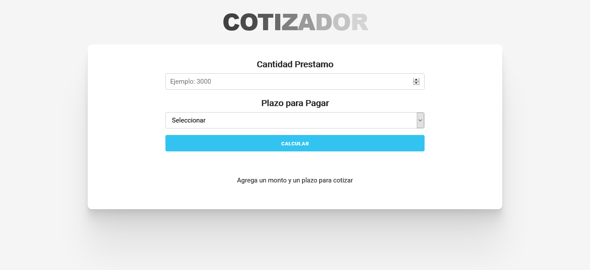

# First React Proyect

## Description

This is my first React.js proyect 😁
It was coded along with Udemy course [JavaScript Moderno Guía Definitiva Construye +15 Proyectos](https://www.udemy.com/course/javascript-moderno-guia-definitiva-construye-10-proyectos/)

I used [Skeleton](http://getskeleton.com/) for some basic styles and [Moving Letters](https://tobiasahlin.com/moving-letters/) for animated title (you can check [this post](https://github.com/romitkarmakar/moving-letters) to use it).

## Screenshot 📸

### Author 🧔

[Marcos Pennachini](https://linkedin.com/in/marcos-pennachini)
